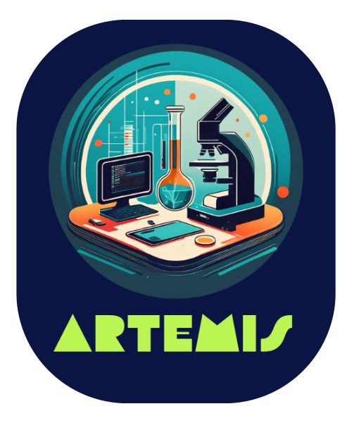

# ARTEMIS: Advanced Result & Test Evaluation Medical Information System



## Overview

ARTEMIS is an AI-powered medical assistant designed to analyze medical test reports, identify abnormal results, and provide insights through a conversational interface. The system helps patients understand their medical reports by highlighting abnormalities, explaining potential causes, and suggesting remedies.

## Features

- **Medical Report Analysis**: Upload and analyze medical test reports in TXT or PDF format
- **Interactive Chat Interface**: Ask follow-up questions about your results
- **Multiple LLM Options**: Choose from various large language models for analysis
- **User-Friendly Interface**: Clean, intuitive design with medical-themed styling
- **Comprehensive Analysis**: Identifies abnormal results, probable causes, and suggested remedies

## Technical Architecture

ARTEMIS consists of two main components:

1. **Frontend (Streamlit)**: User interface for report uploads and chat interactions
2. **Backend (FastAPI)**: Processes reports and handles LLM integration

## Installation

### Prerequisites

- Python 3.8+
- pip package manager

### Setup

1. Clone the repository:
   ```bash
   git clone https://github.com/yourusername/artemis.git
   cd artemis
   ```

2. Install dependencies:
   ```bash
   pip install -r requirements.txt
   ```

3. Create a `.env` file with your API keys:
   ```
   GROQ_API_KEY=your_groq_api_key_here
   ```

## Usage

1. Start the backend server:
   ```bash
   uvicorn server:app --reload
   ```

2. In a separate terminal, launch the Streamlit frontend:
   ```bash
   streamlit run med_app.py
   ```

3. Open your browser and navigate to `http://localhost:8501`

## User Guide

1. **Upload a Medical Report**:
   - Use the sidebar to upload a TXT or PDF file containing your medical test results

2. **Select an LLM Model**:
   - Choose from available models like Llama 3.3, Gemma 2, or others

3. **Analyze the Report**:
   - Click "Analyze Report" to process your medical data

4. **Review Analysis**:
   - The system will display abnormal results, potential causes, and recommendations

5. **Ask Follow-up Questions**:
   - Use the chat interface to ask specific questions about your results

## Supported LLM Models

- Gemma 2 9B Instruct (gemma2-9b-it)
- Llama 3.3 70B Versatile (llama-3.3-70b-versatile)
- Llama 3.1 8B Instant (llama-3.1-8b-instant)
- Qwen QWQ 32B (qwen-qwq-32b)
- Compound Beta (compound-beta)

## Privacy & Security

ARTEMIS processes medical data locally and only sends anonymized information to LLM providers. No personal health information is stored permanently.

## Contributing

Contributions are welcome! Please feel free to submit a Pull Request.

1. Fork the repository
2. Create your feature branch (`git checkout -b feature/amazing-feature`)
3. Commit your changes (`git commit -m 'Add some amazing feature'`)
4. Push to the branch (`git push origin feature/amazing-feature`)
5. Open a Pull Request

## License

This project is licensed under the MIT License - see the LICENSE file for details.

## Acknowledgments

- Groq API for LLM integration
- Streamlit for the interactive web interface
- FastAPI for the backend server